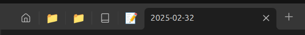
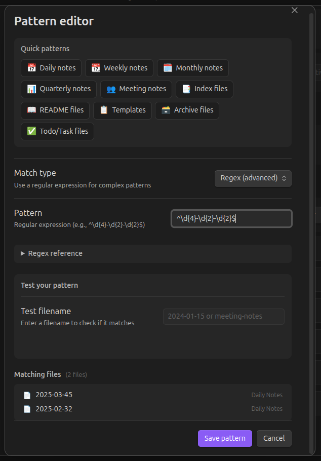

# Pinned Tabs Customizer


Resize pinned tabs and customize their icons with emojis, symbols, or Obsidian icons based on file names, folders, patterns, or tags.

## Features

### Custom icons for pinned tabs

- Assign custom icons to pinned tabs for instant recognition
- Comprehensive icon picker with emojis, Obsidian icons, and custom text
- Recent icons section for quick access
- Supports emojis, symbols, and native Obsidian Lucide icons



### Folder-based rules

- Apply an icon to ALL files in a folder
- Includes subfolders automatically
- Perfect for project folders, areas, or categories


### Frontmatter detection

- Set icon per-file using frontmatter property
- Highest priority - overrides all other rules
- Customizable property name (default: `pinned-icon`)

```yaml
---
pinned-icon: 🏠
---
```

### Advanced pattern matching

- Create patterns to match multiple files at once
- Perfect for daily notes, weekly notes, meeting notes, etc.
- **Simple modes** for all skill levels:
  - **Simple**: Build patterns without regex (starts with, ends with, contains)
  - **Presets**: 10+ ready-to-use patterns (daily notes, weekly notes, templates, etc.)
  - **Advanced**: Write custom regex with built-in reference guide
- Live testing shows which files match your pattern
- Real-time preview of matching files



### Tag-based rules

- Assign icons based on frontmatter or inline tags
- Perfect for flexible, content-based categorization
- Supports both `tags: [project]` and `#project` formats

### Conflict detection

- Visual warnings when multiple rules match the same file
- Shows which files are affected and which rule wins
- Quick action to reorder rules and resolve conflicts

### Adjustable pinned tab width

- **Shrink pinned tabs** toggle: Enable/disable width shrinking
- Customize pinned tab widths (40-200 pixels) when enabled
- Disable to keep normal tab width (only icon changes)
- Reset button to restore default width

## Installation

### From community plugins

1. Open Settings → Community plugins
2. Search for "Pinned Tabs Customizer"
3. Install and enable the plugin

### Manual installation

1. Download the latest release from the [GitHub Releases](https://github.com/diegomarzaa/obsidian-pinned-tabs-customizer/releases) page
2. Extract to your vault's `.obsidian/plugins/pinned-tabs-customizer` folder
3. Enable the plugin in Settings → Community plugins

### Using BRAT

1. Install [BRAT](obsidian://show-plugin?id=obsidian42-brat) plugin
2. Open BRAT settings
3. Add the following URL: `https://github.com/diegomarzaa/obsidian-pinned-tabs-customizer`
4. Select the latest version
5. Click "Add Plugin"
6. Enable the plugin in Settings → Community plugins

## Usage

### Quick icon assignment

1. Right-click any file and select **"Set pinned tab icon"**
2. Select an icon from the picker (emoji, Obsidian icon, or custom text)
3. The mapping is automatically created

### Settings

Navigate to **Settings → Pinned Tabs Customizer** to:

- **Shrink pinned tabs**: Toggle width shrinking
- **Pinned tab width**: Set the width when shrinking is enabled (40-200 pixels)
- **Show default icon**: Toggle whether unmapped tabs show an icon
- **Default icon**: Set a fallback icon (leave empty for native pin icon)
- **Read icon from frontmatter**: Enable/disable and customize the property name
- **Add file**: Map a specific file to an icon
- **Add folder**: Apply icon to all files in a folder
- **Add pattern**: Create pattern rules (starts with, contains, regex, etc.)
- **Add tag**: Assign icon to all files with a specific tag
- **Reorder mappings**: Drag and drop to change priority (first match wins)

### Priority order

1. **Frontmatter** (highest) - `pinned-icon: 🏠` in file
2. **Mappings** - In order (first match wins)
3. **Default icon** (if enabled)

### Commands

Access from command palette (Ctrl+P / Cmd+P):

- **Set icon for current file** - Set icon for the active note
- **Set icon for a file** - Search and set icon for any file
- **Set icon for a folder** - Assign icon to a folder
- **Add pattern rule** - Create a new pattern mapping
- **Add tag rule** - Create a tag-based mapping

### Examples

| Type | Pattern | Matches |
|------|---------|---------|
| Folder | `Projects/` | All files in Projects folder |
| Exact | `Home` | File named "Home" |
| Starts with | `Meeting` | Meeting notes, Meeting agenda, etc. |
| Contains | `archive` | archive-2024, project-archive, etc. |
| Regex | `^\d{4}-\d{2}-\d{2}$` | Daily notes (2024-01-15) |
| Regex | `^\d{4}-W\d{2}$` | Weekly notes (2024-W03) |
| Tag | `project` | All files tagged with #project |

## Contributing

Contributions are welcome! Visit the [GitHub repository](https://github.com/diegomarzaa/obsidian-pinned-tabs-customizer) to:

- Report bugs
- Suggest features
- Submit pull requests

## License

This project is licensed under the [MIT License](LICENSE).

## Acknowledgments

- Inspired by [nicosomb shrink-pinned-tabs plugin](https://github.com/nicosomb/obsidian-shrink-pinned-tabs) and community discussions on tab customization
