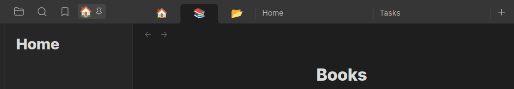
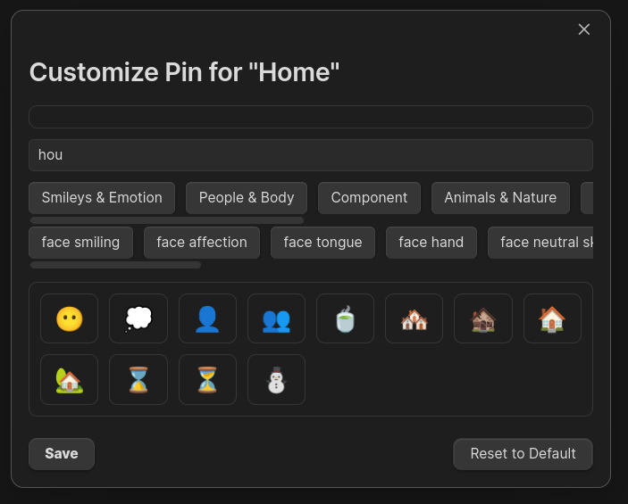
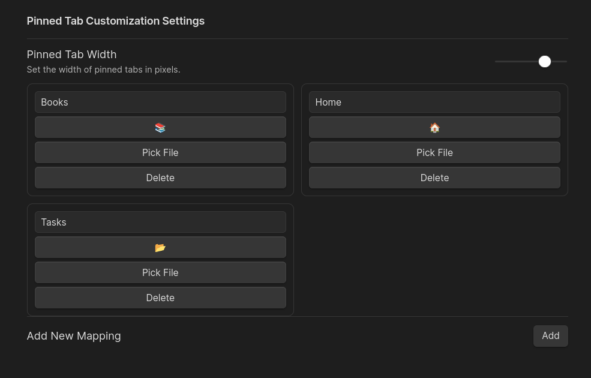

# Pinned Tab Emoji Customizer

**Pinned Tab Emoji Customizer** is a plugin that lets you enhance your pinned tabs by adding custom emojis, managing their appearance, and personalizing your workflow. Perfect for users who want a more visual and engaging experience while working in Obsidian.

A beautiful emoji picker with global search and categories:

Manage pinned tabs and customize emoji mappings:

## ✨ Features

### 🎨 **Custom Emojis for Pinned Tabs**
- Assign custom emojis to pinned tabs for instant recognition.
- Choose from a comprehensive emoji picker with:
    - Global search for any emoji by name.
    - Browsing emojis by category (e.g., Smileys, Objects, Activities).
- Use a default pin emoji (📌) for unmapped tabs or set your own.

### 📂 **File-to-Emoji Mapping**
- Map specific files to custom emojis for seamless organization.
- Easily assign emojis to tabs via a right-click option on tab "Customize pin" option.
- Edit, add, or remove mappings directly in an interactive settings interface.
- By default, the plugin uses the next three mappings:
  - 🏠 for 'Home'
  - 📋 for 'Tasks'
  - 📖 for 'Books'

### 📏 **Adjustable Pinned Tab Width**
- Customize pinned tab widths using an intuitive slider in settings.

## 🚀 Installation

### Manual Installation
1. Download the latest release from the [GitHub Releases](https://github.com/diegomarzaa/obsidian-pinned-tabs-customizer/releases) page.
2. Extract the contents to your vault's `.obsidian/plugins/obsidian-pinned-tabs-customizer` folder.
3. Enable the plugin in Obsidian's **Community plugins** settings.

## 🛠️ How to Use

### **Emoji Picker**
1. Right-click a pinned tab and select **"Customize pin"**.
2. Search for an emoji globally or browse by category.
3. Click an emoji to select it.
4. Click **Save** to apply or **Reset to default** to restore the default pin emoji.

### **Settings Interface**
1. Navigate to **Settings → Pinned Tab Customizer**.
2. **Adjust pinned tab width**:
   - Use the slider to modify pinned tab widths.
3. **Manage File-to-Emoji Mappings**:
   - View, edit, or remove existing mappings.
   - Add new mappings by selecting a file and assigning an emoji.
4. Changes take effect instantly, no restart required!

## 🌟 Roadmap
- [ ] Regex-based tab mapping for advanced use cases.
- [ ] Bulk mapping for multiple files.
- [ ] Enhanced tab styling (colors, borders, fonts, etc.).

## 🤝 Contribution
Contributions are welcome! Whether you’d like to report a bug, suggest a feature, or submit a pull request, visit the [GitHub repository](https://github.com/diegomarzaa/obsidian-pinned-tabs-customizer).

## 📝 License
This project is licensed under the [GNU General Public License](LICENSE).

## 📧 Contact

If you have any questions, feedback, or need assistance, feel free to reach out:

- **GitHub Issues**: [Report an Issue](https://github.com/diegomarzaa/obsidian-pinned-tabs-customizer/issues)
- **Email**: [diegomarzafuertes@gmail.com](mailto:diegomarzafuertes@gmail.com)

## 💡 Acknowledgments
- Inspired by [nicosomb shrink-pinned-tabs plugin](https://github.com/nicosomb/obsidian-shrink-pinned-tabs) and [eduardohilariodev snippet](https://forum.obsidian.md/t/shrink-the-size-of-pinned-tabs-just-like-on-the-browser/).
- Emoji data powered by the [Open Emoji JSON dataset](https://github.com/chalda-pnuzig/emojis.json).

