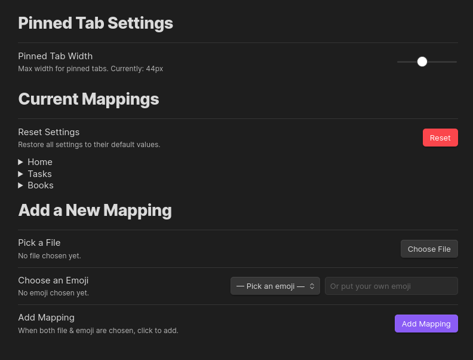
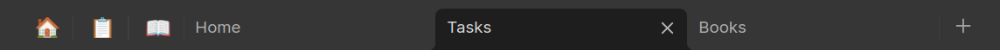

# Obsidian Pinned Tab Emoji Customizer

**Obsidian Pinned Tab Emoji Customizer** is a plugin that lets you enhance your pinned tabs by adding custom emojis, managing their appearance, and personalizing your workflow. Perfect for users who want a more visual and engaging experience while working in Obsidian.

---

## Features

### 🎨 **Custom Emojis for Pinned Tabs**
- Assign any emoji to your pinned tabs for quick visual recognition.
- Use the built-in emoji picker or type/paste your own.

### 📂 **File-to-Emoji Mapping**
- Easily map specific files to emojis.
- Preview and manage all mappings in an intuitive interface.
- By default, the plugin uses the next three mappings:
  - 🏠 for 'Home'
  - 📋 for 'Tasks'
  - 📖 for 'Books'

### 📏 **Adjustable Pinned Tab Width**
- Customize the width of your pinned tabs with a handy slider.

### 🖼️ **Default Emoji for Unmapped Tabs**
- Automatically applies a pin emoji (`📌`) to pinned tabs without specific mappings.

---

## Installation

### Manual Installation
1. Download the latest release from the [GitHub Releases](https://github.com/diegomarzaa/obsidian-pinned-tabs-customizer/releases) page.
2. Extract the contents to your vault's `.obsidian/plugins/obsidian-pinned-tab-customizer` folder.
3. Enable the plugin in Obsidian's **Community plugins** settings.

---

## How to Use

### Configure Pinned Tab Appearance
1. Go to **Settings → Pinned Tab Customizer**.
2. Adjust the **Pinned Tab Width** slider to change the width of pinned tabs.

### Manage File-to-Emoji Mappings
1. In the **Current Mappings** section:
   - View, edit, or remove existing mappings.
2. In the **Add a New Mapping** section:
   - Choose a file using the **Pick a File** button.
   - Select an emoji using the **Choose an Emoji** dropdown or put your own.
   - Click **Add Mapping** to save.

### Default Emoji for Unmapped Tabs
- Tabs without a specific mapping will automatically display the pin emoji (`📌`).

---

## Screenshots

### **Settings Interface**

### **Usage Example (pin vs no pin)**

---

## Roadmap
- [ ] Add advanced tab customization options (colors, borders, fonts, etc.).
- [ ] Support bulk mappings for multiple files.
- [ ] Dark mode-specific adjustments.

---

## Contribution
Contributions are welcome! If you'd like to report bugs, suggest features, or submit pull requests, please visit the [GitHub repository](https://github.com/diegomarzaa/obsidian-pinned-tabs-customizer).

---

## License
This project is licensed under the [GNU GENERAL PUBLIC LICENSE](LICENSE).

---

## Acknowledgments
- Built with love for the Obsidian community.
- Inspired by [nicosomb shrink-pinned-tabs plugin](https://github.com/nicosomb/obsidian-shrink-pinned-tabs) and [eduardohilariodev snippet](https://forum.obsidian.md/t/shrink-the-size-of-pinned-tabs-just-like-on-the-browser/88943?utm_source=chatgpt.com)
